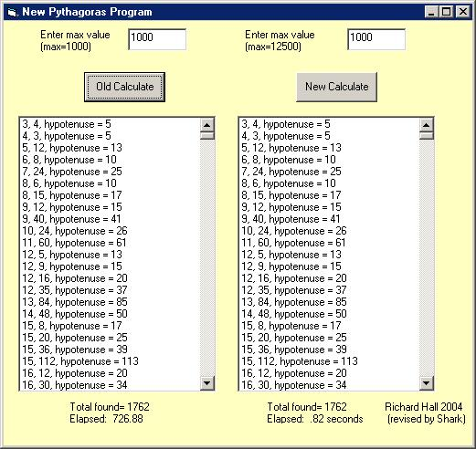



## Pythagorean Triples \(Enhanced\)

### Description

Pythagorean Triples are integers in the form a^2+b^2=c^2 (example...3,4,5 because 3*3+4*4=5*5). This post is an improvement to the original post (txtCodeId=53514&lngWId=1) to display Pythagorean Triples. The original version took over 12 minutes with a max set to 1000. My version takes under 1 second.
 
### More Info
 

             |
---                |---
**Submitted On**   |2004-05-05 01:02:28
**By**             |[Shark](https://github.com/Planet-Source-Code/PSCIndex/blob/master/ByAuthor/shark.md)
**Level**          |Beginner
**User Rating**    |4.8 (19 globes from 4 users)
**Compatibility**  |VB 6\.0
**Category**       |[Complete Applications](https://github.com/Planet-Source-Code/PSCIndex/blob/master/ByCategory/complete-applications__1-27.md)
**World**          |[Visual Basic](https://github.com/Planet-Source-Code/PSCIndex/blob/master/ByWorld/visual-basic.md)
**Archive File**   |[Pythagorea174131552004\.zip](https://github.com/Planet-Source-Code/shark-pythagorean-triples-enhanced__1-53571/archive/master.zip)

